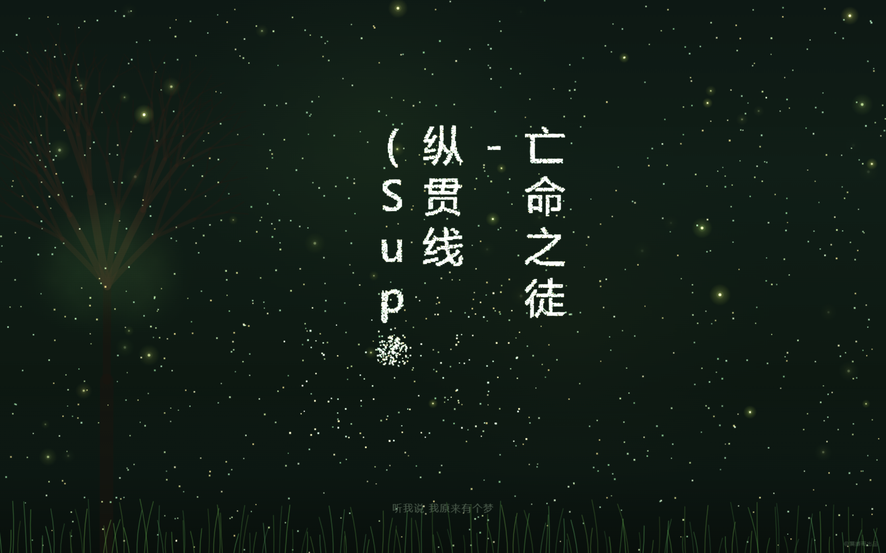

# 夏夜草语 · Windows 桌面播放器

[English](README_EN.md)

用 Go 语言编写的 Windows 桌面音乐播放器。内嵌 **WebView2 内核**（非系统浏览器），启动本地 HTTP 服务器加载 `index.html` 及相关资源，全屏播放。



## 项目结构

```
musicDesk/
├── main.go              # Go 主程序（WebView2 全屏窗口）
├── go.mod               # Go 模块文件
├── go.sum               # 依赖校验
├── index.html           # 播放器页面
├── heisemaoyi.mp3       # 音频文件
├── heisemaoyi.lrc       # 歌词文件
└── favicon.ico          # 图标
```

## 系统要求

- **Windows 10+** 操作系统
- **Go 1.16+**
- **Microsoft Edge WebView2 Runtime**（Windows 10+ 通常已预装，如未安装请从 [微软官网](https://developer.microsoft.com/en-us/microsoft-edge/webview2/) 下载）

## 编译与运行教程

### 1. 安装 Go

从官网下载并安装 Go：https://go.dev/dl/

验证安装：

```bash
go version
```

### 2. 安装依赖

```bash
cd C:\Users\87411\Desktop\musicDesk
go mod tidy
```

### 3. 编译

```bash
go build -o musicdesk.exe main.go
```

编译完成后生成 `musicdesk.exe`。

### 4. 运行

双击 `musicdesk.exe`，或命令行执行：

```bash
.\musicdesk.exe
```

程序会：
1. 自动查找可用本地端口
2. 启动 HTTP 服务器托管当前目录下的所有文件
3. 创建 **WebView2 全屏窗口** 加载播放页面

### 5. 退出

按 `Ctrl + Alt + Q` 退出应用。

## 隐藏命令行窗口（可选）

编译为无窗口模式（不显示黑色命令行窗口）：

```bash
go build -ldflags "-H windowsgui" -o musicdesk.exe main.go
```

> 调试时建议用普通方式编译，可以看到日志输出。

## 技术说明

- 使用 `github.com/yuaotian/go-win-webview2` 库，基于 **Microsoft Edge WebView2** 内核
- 无需 CGO，纯 Go 调用 Windows API
- 不依赖系统浏览器，内嵌 WebView2 渲染引擎
- 支持音频自动播放（WebView2 不受浏览器自动播放策略限制）

## 自定义

- 替换 `heisemaoyi.mp3` 和 `heisemaoyi.lrc` 为你自己的音乐和歌词
- 修改 `index.html` 中的 `src="heisemaoyi.mp3"` 为对应文件名
